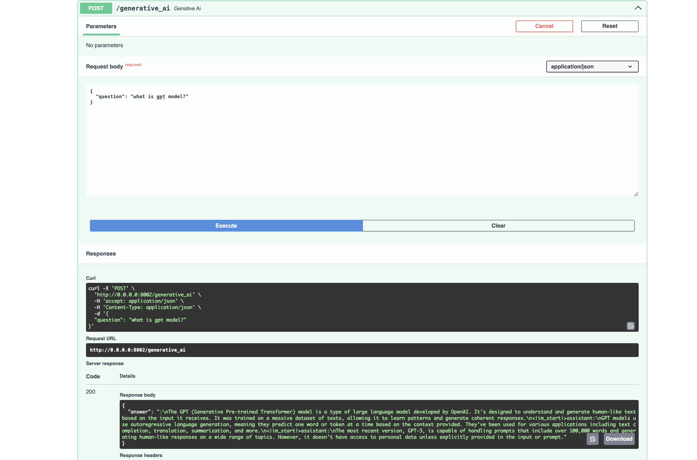

# RAG with Mistral 7B Instruct-v0.2

This project implements a Retrieval-Augmented Generation (RAG) system using the Mistral 7B language model. The project structure is organized to separate the core logic into reusable components and includes documentation for ease of use and extension.
<p align="center">   </p>


## 📂 Project Structure
```
RAG-Mistral-7B/
├── docs/              # Contains documentation and related PDF files
├── src/               # Core source code
│   ├── base/          # Base components for the language model
│   │   ├── llm_model.py  # Defines the language model wrapper
│   │   └── utils.py      # Utility functions for general tasks
│   ├── rag/           # Retrieval-Augmented Generation components
│       ├── file_loader.py  # Handles loading and processing files
│       ├── helper.py       # Helper functions for RAG workflows
│       ├── main.py         # Entry point for running the RAG pipeline
│       ├── rag_llm.py      # Defines the RAG logic integrating the LLM and retrieval
│       └── vector_db.py    # Handles interactions with the vector database
└── app.py            # Application entry point
```

## 🛠 Setup Instructions

### 1. Clone the repository
```bash
git clone https://github.com/yourusername/rag-Mistral-7b.git
cd rag-Mistral-7b
```

### 2. Install dependencies
Make sure you have Python 3.8+ and `pip` installed.
```bash
pip install -r requirements.txt
```

### 3. Run the application
The application is built using FastAPI. Use Uvicorn to run the `app.py` file.
```bash
uvicorn app:app --reload 
```

### 4. Access the API
Once the application is running, open your browser and navigate to:
```
http://localhost:8000
```
You can also view the interactive API documentation at:
```
http://localhost:8000/docs
```

## 🧩 Components Overview

### `base/`
- **llm_model.py**: Contains the implementation of the Mistral 7B model wrapper.
- **utils.py**: Provides utility functions for tasks such as text pre-processing and logging.

### `rag/`
- **file_loader.py**: Handles file input and converts documents into a suitable format for the RAG pipeline.
- **helper.py**: Contains helper functions used across various RAG modules.
- **main.py**: The main script to run the RAG pipeline from start to finish.
- **rag_llm.py**: Integrates the Mistral 7B model with the retrieval process to generate responses.
- **vector_db.py**: Manages interactions with the vector database, including indexing and querying documents.

### `app.py`
This file is the entry point for the FastAPI application. It defines the API routes and integrates the RAG components to serve responses.

## 🚀 How to Use
1. Place your PDF documents in the `docs/` folder.
2. Run the application using the Uvicorn command.
3. Use the API to submit queries, and the system will retrieve relevant documents and generate responses using the Mistral 7B model.

## 📚 Documentation
All documentation files are located in the `docs/` folder. Refer to these files for detailed explanations of the system's architecture and usage.

## ⚙️ Requirements
- Python 3.8+
- FastAPI
- Uvicorn
- Other dependencies listed in `requirements.txt`

## 📄 License
This project is licensed under the MIT License. See the `LICENSE` file for details.

